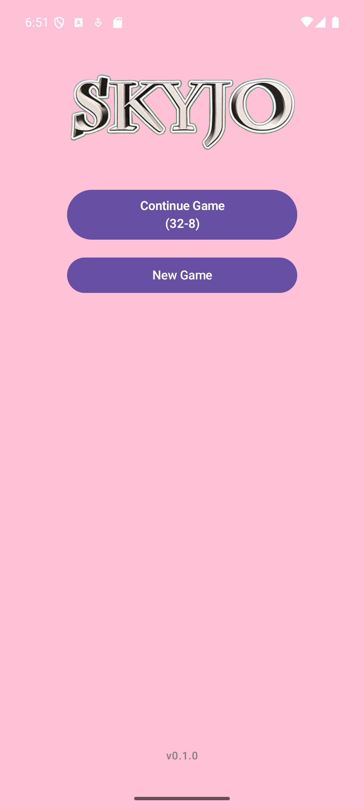
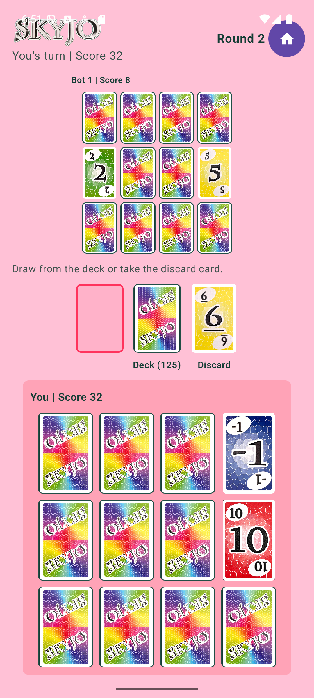

# SKYJO Android

Small Android side project for private use: a personal SKYJO-style app built with Kotlin, Jetpack Compose, and a separate game-logic module.

This project is unofficial and is not affiliated with, endorsed by, or published by Magilano.

## Screenshots

| Menu | In game |
| --- | --- |
|  |  |

## Copyright

SKYJO, the SKYJO name, rules, game concept, card design, artwork, trade dress, and all related intellectual property belong to Magilano and Alexander Bernhardt, the creator of the game.

This repository is only a private side project for learning and personal play. It is not intended for public distribution, commercial use, resale, or publication as an official SKYJO product. Buy and support the original game from Magilano.

## Tech Stack

- Android app: Kotlin + Jetpack Compose
- Game engine: Kotlin JVM module in `game`
- Build system: Gradle / Android Gradle Plugin
- App version: read from `package.json`

## Project Structure

- `app`: Android application and Compose UI
- `game`: Pure Kotlin game state, reducer, scoring, and bot AI
- `cards`: Source card image assets
- `app/release`: Locally generated release APK output

## Development Guide

### Open in Android Studio

1. Open this repository folder in Android Studio.
2. Let Gradle sync.
3. Select the `app` run configuration.
4. Run on an emulator or Android device.

### Run Tests

From the repository root:

```powershell
.\gradlew.bat test
```

### Build a Debug APK

```powershell
.\gradlew.bat assembleDebug
```

Output:

```text
app/build/outputs/apk/debug/
```

### Build a Release APK

Use Android Studio:

1. `Build` -> `Generate Signed Bundle / APK...`
2. Choose `APK`
3. Select or create your private signing key
4. Choose the `release` variant
5. Finish the wizard

Release output is usually written to:

```text
app/release/app-release.apk
```

### Versioning

Before every release:

1. Update `version` in `package.json`.
2. Increment `versionCode` in `app/build.gradle`.
3. Build a new signed release APK.
4. Create a matching Git tag, for example `v0.1.1`.

## Private Use Notice

Keep signing keys, generated keystore files, and private release artifacts out of Git. If this project ever becomes public, remove any copyrighted Magilano assets first and replace them with original or properly licensed assets.
